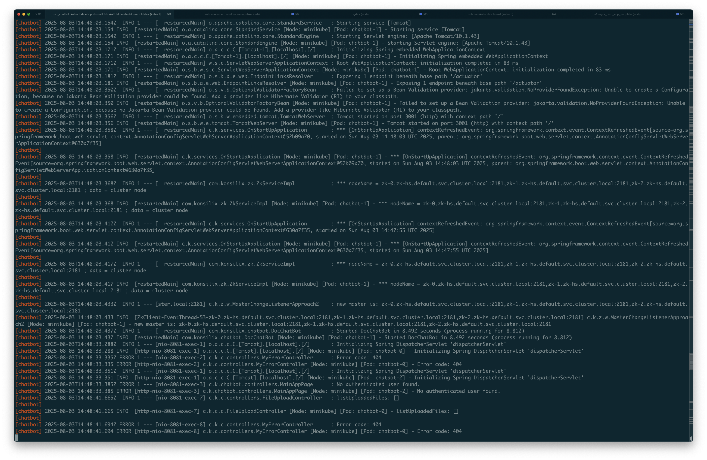

# README.md

Instructions on how to build while running on a k8s cluster:

First and foremost, you need to create `application.yaml` in `src/main/resources`
Copy `src/main/resources/application.yml.template` to `src/main/resources/application.yaml` and
fill in the pertinent configuration data.

In one terminal:
1. `eval $(minikube -p minikube docker-env)`
2. `kubectl delete pods --all && skaffold delete && skaffold dev`

In another terminal:
1. `eval $(minikube -p minikube docker-env)`
2. `minikube tunnel --cleanup=true`
3. `kubectl get service chatbot-loadbalancer` to check if you have the external IP

You should see the following:
```bash
kubectl get service chatbot-loadbalancer
NAME                   TYPE           CLUSTER-IP     EXTERNAL-IP   PORT(S)          AGE
chatbot-loadbalancer   LoadBalancer   10.99.56.153   127.0.0.1     8080:31784/TCP   88s
```

In your browser:
1. Based upon that information directly above, open up the following URL `http://127.0.0.1:8080`
2. You should see the following from the app:
   

Adding thread name and pod name to logback-spring.xml. Now you can trace your code running on pods.

```log
[chatbot] 2025-08-03 14:48:03.437 INFO  [restartedMain] com.konsilix.chatbot.DocChatBot [Node: minikube] [Pod: chatbot-1] - Started DocChatBot in 8.492 seconds (process running for 8.812)
[chatbot] 2025-08-03T14:48:33.288Z  INFO 1 --- [nio-8081-exec-1] o.a.c.c.C.[Tomcat].[localhost].[/]       : Initializing Spring DispatcherServlet 'dispatcherServlet'
[chatbot] 2025-08-03 14:48:33.288 INFO  [http-nio-8081-exec-1] o.a.c.c.C.[Tomcat].[localhost].[/] [Node: minikube] [Pod: chatbot-0] - Initializing Spring DispatcherServlet 'dispatcherServlet'
[chatbot] 2025-08-03T14:48:33.335Z ERROR 1 --- [nio-8081-exec-2] c.k.c.controllers.MyErrorController      : Error code: 404
[chatbot] 2025-08-03 14:48:33.335 ERROR [http-nio-8081-exec-2] c.k.c.controllers.MyErrorController [Node: minikube] [Pod: chatbot-0] - Error code: 404
[chatbot] 2025-08-03T14:48:33.351Z  INFO 1 --- [nio-8081-exec-1] o.a.c.c.C.[Tomcat].[localhost].[/]       : Initializing Spring DispatcherServlet 'dispatcherServlet'
[chatbot] 2025-08-03 14:48:33.351 INFO  [http-nio-8081-exec-1] o.a.c.c.C.[Tomcat].[localhost].[/] [Node: minikube] [Pod: chatbot-2] - Initializing Spring DispatcherServlet 'dispatcherServlet'
[chatbot] 2025-08-03T14:48:33.385Z ERROR 1 --- [nio-8081-exec-3] c.k.chatbot.controllers.MainAppPage      : No authenticated user found.
[chatbot] 2025-08-03 14:48:33.385 ERROR [http-nio-8081-exec-3] c.k.chatbot.controllers.MainAppPage [Node: minikube] [Pod: chatbot-2] - No authenticated user found.
[chatbot] 2025-08-03T14:48:41.665Z  INFO 1 --- [nio-8081-exec-7] c.k.c.controllers.FileUploadController   : listUploadedFiles: []
[chatbot]
[chatbot] 2025-08-03 14:48:41.665 INFO  [http-nio-8081-exec-7] c.k.c.c.FileUploadController [Node: minikube] [Pod: chatbot-0] - listUploadedFiles: []
[chatbot]
[chatbot] 2025-08-03T14:48:41.694Z ERROR 1 --- [nio-8081-exec-8] c.k.c.controllers.MyErrorController      : Error code: 404
[chatbot] 2025-08-03 14:48:41.694 ERROR [http-nio-8081-exec-8] c.k.c.controllers.MyErrorController [Node: minikube] [Pod: chatbot-0] - Error code: 404```