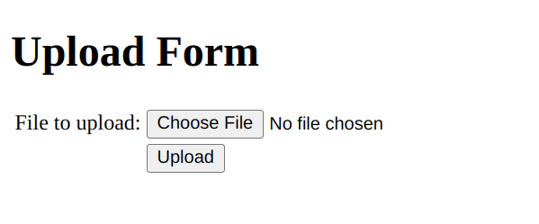

# README
## Spinning up K8s services using Helm


Go to intellij -> setting -> Build, Execution, Deployment -> Compiler -> Build Project automatically -> apply
Go to Docker -> Setting -> Resources -> File Sharing -> Share relevant files
minikube start --mount --mount-string="{replace with absolute path to theApp}:/theApp" --driver=docker
# Tried mounting java dependencies (.m2 file) into the containers so that they wouldn't have to be reinstalled during
# compliation. However, getting an error of not being able to resolve the symlink to specific files.
# minikube mount {replace with absolute path to .m2}:/.m2
Run "skaffold dev" in the main directory
Run "minikube tunnel"
Go to your browser and type "localhost:3000"
Authenticate in one pod and make sure it is authenticated in every pod(refresh the page)


```bash
../k8s/cluster_build_image.sh
helm install theApp ./theApp
minikube service theApp-loadbalancer --url
```
then look on your browser



## Using Docker Hub for images
If you want to use your own Docker account, you can run the following
and then update the image name in helm/zkapp/templates/zkapp-statefulset.yaml;
for example, change `zkapp:v1` to `robmarano/zkapp:v1`
Change `robmarano` to your Docker user name.
```bash
eval $(minikube -p minikube docker-env)
docker login
docker tag zkapp:v1 robmarano/theApp:v1
docker image ls
docker push robmarano/theApp:v1
```